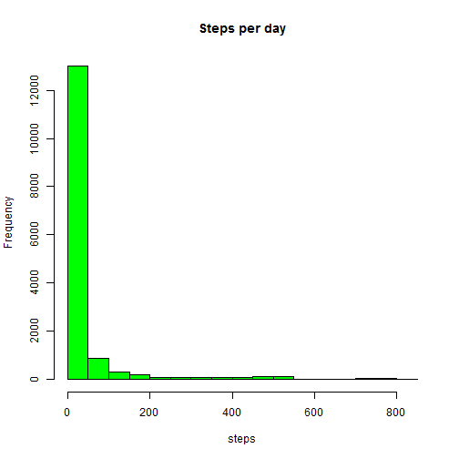
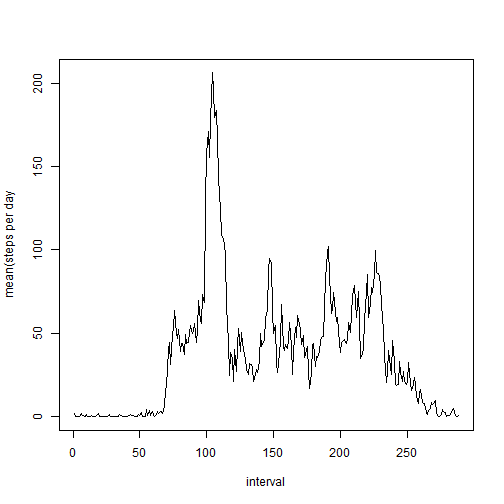
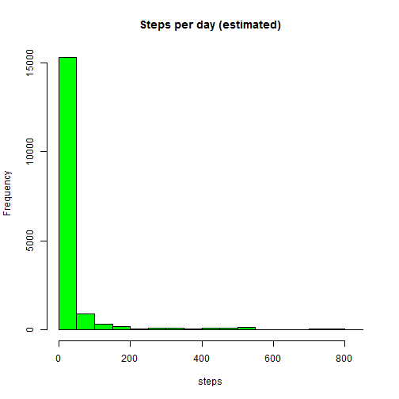
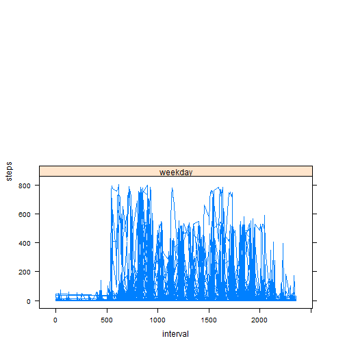

repdata-004 : Peer Assesment 1 
========================================================


# Loading and preprocessing the data

* The data is read from the csv file.


```r
activityData <- read.csv(file="activity.csv");

head(activityData);
```

```
##   steps       date interval
## 1    NA 2012-10-01        0
## 2    NA 2012-10-01        5
## 3    NA 2012-10-01       10
## 4    NA 2012-10-01       15
## 5    NA 2012-10-01       20
## 6    NA 2012-10-01       25
```


* Initially, $date is treated as a string factor.


```r
lapply(activityData, class)
```

```
## $steps
## [1] "integer"
## 
## $date
## [1] "factor"
## 
## $interval
## [1] "integer"
```

* It's converted using basic functions.


```r
activityData$date <- as.Date(activityData$date)

class(activityData$date)
```

```
## [1] "Date"
```

* We're going to need data with and without nas


```r
dataFiltered <- activityData[!is.na(activityData$steps),]
dataRaw      <- activityData
```


* We'll be 

# What is mean total number of steps taken per day?


```r
data <- dataFiltered 

hist(data$steps, col="green", main="Steps per day" , xlab="steps");
```

 

* Now for the concrete values:


```r
c( mean(data$steps) , median(data$steps))
```

```
## [1] 37.38  0.00
```

# What is the average daily activity pattern?

Looking at it in terms of intervals:

* First we build a summary table:


```r
intervalData <- data.frame(interval = unique(activityData$interval));

for (i in 1:nrow(intervalData)) {
  subset <- data[data$interval == data[i,"interval"],];
  intervalData[i,"mean_all_days"] <- mean(subset$steps)
};

head(intervalData);
```

```
##   interval mean_all_days
## 1        0       1.71698
## 2        5       0.33962
## 3       10       0.13208
## 4       15       0.15094
## 5       20       0.07547
## 6       25       2.09434
```

* Then we plot it:


```r
plot(intervalData$mean_all_days
     , type="l"
     , xlab="interval"
     , ylab="mean(steps per day"
     );
```

 

* Let's get a concrete number for the interval with the largest mean:


```r
intervalData[which.max(intervalData$mean_all_days),]
```

```
##     interval mean_all_days
## 104      835         206.2
```

# Inputing missing values

Looks like all those NAs we filtered might cause problems.

* Let's get a count:


```r
nrow(dataRaw[is.na(dataRaw$steps),])
```

```
## [1] 2304
```

* We're going to normalize the results in a new copy of the raw data.

 

```r
estimated <- data.frame(dataRaw[0,]);
estimated <- rbind(estimated, dataRaw)

head(estimated)
```

```
##   steps       date interval
## 1    NA 2012-10-01        0
## 2    NA 2012-10-01        5
## 3    NA 2012-10-01       10
## 4    NA 2012-10-01       15
## 5    NA 2012-10-01       20
## 6    NA 2012-10-01       25
```

* We'll fill the NA with the interval mean from before working with the new data.


```r
for (i in 1:nrow(intervalData) ) {
  interval <- intervalData[i,"interval"]
  meanVal <- intervalData[i,"mean_all_days"]
    
  rows <- which(is.na(estimated$steps))
  estimated[rows, "steps"] <- meanVal
}

data <- estimated

head(data)
```

```
##   steps       date interval
## 1 1.717 2012-10-01        0
## 2 1.717 2012-10-01        5
## 3 1.717 2012-10-01       10
## 4 1.717 2012-10-01       15
## 5 1.717 2012-10-01       20
## 6 1.717 2012-10-01       25
```

* Now we'll plot the new data:


```r
hist(data$steps, col="green", main="Steps per day (estimated)" , xlab="steps");
```

 

* And recalulate the core values


```r
c( mean(data$steps) , median(data$steps))
```

```
## [1] 32.71  0.00
```

* Including all that missing data had a significant effect on the mean (~1/6 the original value)

# Are there differences in activity patterns between weekdays and weekends?

* To categorize the date, we'll have to process the data into a new column.


```r
isWeekend <- function(x) {
  if( x == "Sunday" || x == "Saturday") "weekend" else "weekday";
}

data$day <- weekdays(data$date)
data$dayType <- lapply(data$day, isWeekend)

#make it a factor
data$dayType <- sapply(data$dayType, as.factor)

print(lapply(data, class))
```

```
## $steps
## [1] "numeric"
## 
## $date
## [1] "Date"
## 
## $interval
## [1] "integer"
## 
## $day
## [1] "character"
## 
## $dayType
## [1] "factor"
```

* Tada: 


```r
head(data[data$dayType == "weekday",])
```

```
##   steps       date interval    day dayType
## 1 1.717 2012-10-01        0 Monday weekday
## 2 1.717 2012-10-01        5 Monday weekday
## 3 1.717 2012-10-01       10 Monday weekday
## 4 1.717 2012-10-01       15 Monday weekday
## 5 1.717 2012-10-01       20 Monday weekday
## 6 1.717 2012-10-01       25 Monday weekday
```

```r
head(data[data$dayType == "weekend",])
```

```
##      steps       date interval      day dayType
## 1441     0 2012-10-06        0 Saturday weekend
## 1442     0 2012-10-06        5 Saturday weekend
## 1443     0 2012-10-06       10 Saturday weekend
## 1444     0 2012-10-06       15 Saturday weekend
## 1445     0 2012-10-06       20 Saturday weekend
## 1446     0 2012-10-06       25 Saturday weekend
```

* So now we need to graph them:


```r
library("lattice")

dayType <- data$dayType

xyplot( steps~interval | dayType, data=data, type="l", layout=c(1,2))
```

 
